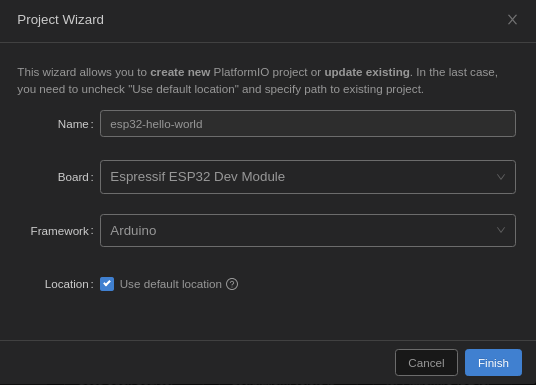

# ESP 32 - Hello World

## Getting Started

### Preparing the IDE

Talking to @bb I have been pointed to [Platform IO](https://platformio.org/) as a potential IDE for micro controller development, which is based on VS Code.

To not mix up my existing VS Code instance (with settings and set of extensions) I created an `alias` to install the Platform IO extension seperately:

```bash
alias pio='code --extensions-dir ~/.vscode-pio/extensions --user-data-dir ~/.vscode-pio'
```

Now I was able to start VS Code with an isolated environment and [installed Platform IO extension](https://platformio.org/install/ide?install=vscode).

### Creating a New Project

After restarting VS Code with proper PIO extension installed I used the *home* screen to create a new project "*esp32-hello-world*". My ESP32 development board was a **ESP32-WROOM-32** from Espressif.



### Writing the Application

The first straight forward (google-copy-paste-approach) implementation failed due to missing definition of `LED_BUILTIN`:

```cpp
#include <Arduino.h>

void setup() {
  pinMode(LED_BUILTIN, OUTPUT);
}
 
void loop() {
  digitalWrite(LED_BUILTIN, HIGH);
  delay(500);
  digitalWrite(LED_BUILTIN, LOW);
  delay(500);
}
```

But a quick search brought the fix:

```cpp
#define LED_BUILTIN 2
```
